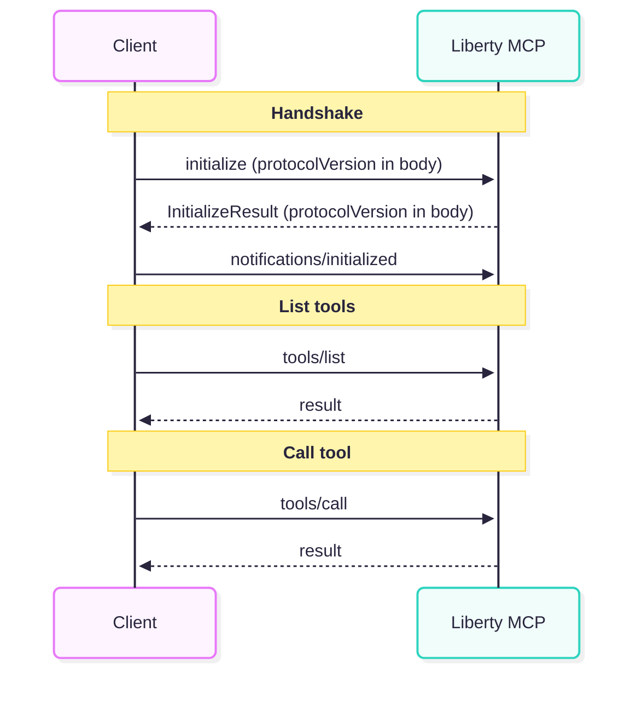
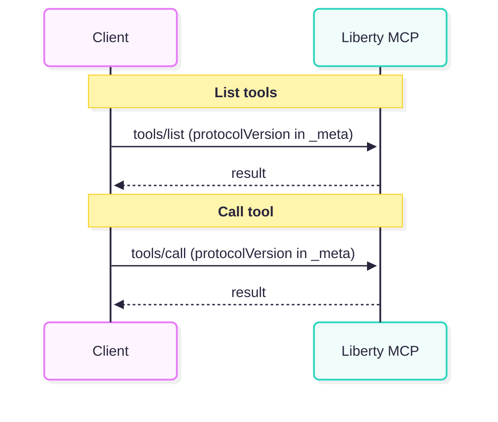
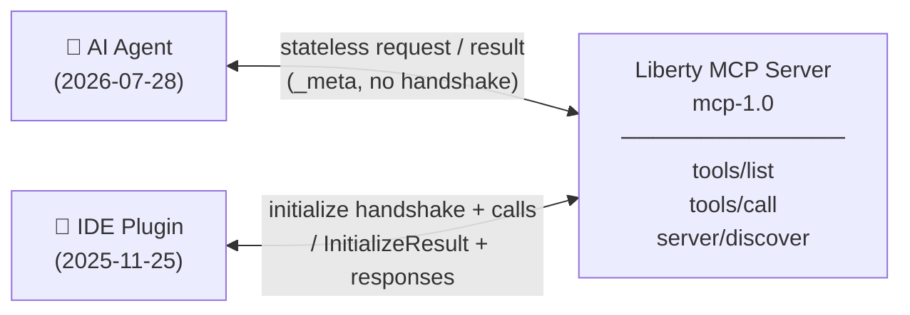

<!--
Guidance on using the template
- Use a mix of bullets and full paragraphs as if you were combining a presentation and
  speaker notes in one document.  
- Any referenced images should be checked into source control alongside your markdown.
- Use a markdown editor with a built-in linter such as `vscode` to ensure consistent rendering

CREATING SLIDES/PRESENTATION
- To create slides from this document, you can use Marp (Markdown Presentation Ecosystem):
   - Install Marp VSCode extension or CLI
   - Export to PDF/HTML/PPTX
   - Slide breaks occur at --- Add more slide breaks as needed
   - See https://marp.app/guide/ for more details
--> 

# Support MCP protocol version `2026-07-28`

**Architect:** Andrew Rouse

**Date:** 2026-10-02

**Associated Epic(s):** [open-liberty#35493](https://github.com/OpenLiberty/open-liberty/issues/35493)

---

## Design Thinking
<!-- _class: lead -->

---

### Technical Background

Model Context Protocol (MCP) is an open standard that allows AI agents and large language model (LLM) clients to call tools exposed by servers. An MCP server advertises a set of callable tools; an MCP client (typically an AI agent or IDE plugin) discovers and invokes those tools using a JSON-RPC 2.0 based protocol over a transport such as Streamable HTTP or STDIO.

Open Liberty supports the server side of MCP over the Streamable HTTP transport. A Liberty application can expose its business logic as MCP tools, making them callable by any MCP-compatible AI agent. Liberty does not implement the full MCP protocol (e.g. resources, prompts, sampling, roots) — it implements the **tools** capability and the core protocol machinery needed to support it: initialization/handshake, transport, and tool listing and invocation.

---

The MCP specification is versioned by date. Liberty currently implements protocol version **2025-11-25**. The MCP community has since published **2026-07-28**, which contains significant changes to the core protocol that affect how Liberty's MCP server implementation operates, including changes to session management, the initialization handshake, transport, and notifications.

---

Key concepts:

- **Protocol version**: Identified by an ISO date string (e.g. `2026-07-28`) and negotiated between client and server, allowing servers to support multiple versions and retain backwards compatibility.
- **Tools**: Callable functions a server exposes. A tool has a name, description, and input/output JSON Schema. Clients call `tools/list` to discover tools and `tools/call` to invoke them.

---

### Problem Statement

MCP clients (AI agents, IDE plugins, desktop assistants, etc.) are beginning to adopt the `2026-07-28` protocol version. MCP clients are expected to continue supporting older protocol versions for some time, so this is not an immediate compatibility crisis — but Liberty risks falling behind as the ecosystem moves forward.

A more compelling reason to adopt `2026-07-28` is architectural: the protocol is now **stateless**, which greatly eases scaling deployments and makes high availability straightforward without requiring sticky load balancers or shared session state. With earlier protocol versions, Liberty can be configured to run in a stateless mode, but with the loss of some functionality.

---

The `2026-07-28` specification makes several **breaking changes** to the core protocol compared to `2025-11-25`:

- The `initialize`/`notifications/initialized` handshake is **removed**; clients that implement `2026-07-28` will not send an `initialize` request before calling tools.
- A new `server/discover` RPC is **required**
  - This provides information about the server that was previously communicated during the `initialize` handshake, such as its capabilities
- The `Mcp-Session-Id` header and server-maintained session state are **removed**; stateless operation is now required.
- The `ping` method is **removed**.
- `tools/list` results now **must** include `ttlMs` and `cacheScope` fields.
- Results must carry a `resultType` field (`"complete"` or `"input_required"`).

---

### Interested Users

- Users who are exposing Liberty applications as MCP servers so that AI agents can call their business logic as tools, and who need those servers to be compatible with the latest MCP client versions.
- Users who want to deploy Liberty MCP servers in cloud or container environments with horizontal scaling and high availability, without needing session-affinity routing or shared session state.
- Users who are integrating Liberty MCP servers with AI tooling that has already adopted the `2026-07-28` protocol version.

---

### High Level User Stories

- As a **Liberty application developer**, I want my MCP server to be compatible with `2026-07-28` clients so that AI agents using the latest protocol version can discover and invoke my tools.
- As a **Liberty application developer**, I want my MCP server to continue working with `2025-11-25`, `2025-06-18` and `2025-03-26` clients so that my consumers do not need to upgrade immediately.

---

- As a **system administrator**, I want to deploy my Liberty MCP server behind a standard HTTP load balancer so that I can scale horizontally and achieve high availability without configuring session affinity.
- As a **system administrator**, I want to route MCP requests to different backend services based on the tool being called or its arguments so that I can partition workloads across specialised servers.

---

### Story 1: Compatible with `2026-07-28` clients

#### As-Is

A developer deploys a Liberty MCP server that only speaks `2025-11-25`. A `2026-07-28` client sends a request with the protocol version carried in `_meta` (no `initialize` handshake). Liberty doesn't recognise this pattern and rejects or mishandles the request. If the client also supports `2025-11-25`, it can detect the failure, fall back to the `initialize` handshake, and successfully negotiate `2025-11-25` — so clients that support both versions still work. However, clients that only support `2026-07-28` have no fallback and fail entirely.

---

#### To-Be

Liberty supports `2026-07-28` alongside the older versions (`2025-11-25`, `2025-06-18`, `2025-03-26`) on the same endpoint. A `2026-07-28` client sends a request with protocol version in `_meta`; Liberty responds correctly under `2026-07-28`. A client using an older version sends an `initialize` handshake; Liberty recognises this and serves it under the negotiated older version. All clients work without any configuration changes.

---

### Story 2: Continue working with older clients

#### As-Is

N/A — this story is about preserving existing behaviour. Today's Liberty already supports `2025-11-25`, `2025-06-18` and `2025-03-26` clients correctly.

#### To-Be

After upgrading to the new Liberty version, existing `2025-11-25`, `2025-06-18` and `2025-03-26` clients continue to work without any changes on the client side.

---

### Story 3: Deploy behind a standard HTTP load balancer


#### As-Is

A system administrator deploying multiple Liberty MCP server instances must either
- configure session-affinity (sticky) routing on their load balancer
  - the `2025-11-25` protocol ties a client to a specific server instance via `Mcp-Session-Id`
  - without sticky routing, requests routed to a different instance fail.
- enable liberty's `stateless` mode
  - some protocol features (e.g. cancelling a tool call) are unavailable

---

#### To-Be

Because `2026-07-28` is fully stateless, all Liberty instances handle any request identically. The administrator deploys Liberty MCP servers behind a plain round-robin load balancer with no session affinity required, and no protocol features are lost.

---

### Story 4: Route requests based on tool name or arguments

#### As-Is

All MCP requests are HTTP POSTs with a JSON body. The tool name and arguments are buried inside the JSON payload, so an HTTP load balancer cannot inspect them without body parsing.

---

#### To-Be

`2026-07-28` requires clients to send `Mcp-Method` and `Mcp-Name` HTTP headers on every POST, and tool parameters annotated with `@McpParamHeader` are promoted to HTTP headers. A system administrator can configure their load balancer to route on these standard headers — for example, sending calls to a `heavyProcessingTool` to a dedicated high-memory cluster — without any application changes.

For load balancer routing based on headers to be reliable, the administrator must ensure that only `2026-07-28` clients can connect  (as older clients do not send these headers). Liberty supports this via configuration to restrict the accepted protocol versions. Additionally, Liberty validates that the `Mcp-Method`, `Mcp-Name` and any `Mcp-Param-*` headers are present and consistent with the request body, rejecting requests where they are missing or mismatched.

---

### Feature Design

This feature updates the existing `mcp-1.0` Liberty feature to support the `2026-07-28` protocol version alongside the existing `2025-11-25`, `2025-06-18` and `2025-03-26` versions.

---

#### Version negotiation and dual-protocol handling

The server must distinguish between requests from `2026-07-28` clients (which carry protocol version in `_meta` on every request, with no prior handshake) and requests from older clients (which begin with an `initialize` handshake). A new request parsing layer is introduced to detect which protocol version is in use and parse the message accordingly.

---

Old sequence (`2025-11-25` and earlier)



---

New sequence (`2026-07-28`)



---

If the server receives a request with a protocol version it does not support, it returns an `Unsupported protocol version` error, which includes information about the protocol versions it does support.

Old handshake methods (`initialize`, `notifications/initialized`) and `ping` are restricted to older protocol versions; a `2026-07-28` request that invokes them receives a "no such method" error.

The `server/discover` method is implemented and must be supported on `2026-07-28`. It allows clients to probe the server's supported protocol versions and capabilities. In previous versions this information was included in the `initialize` handshake.

---

#### Client context interface

In older protocol versions, some per-client data (such as client identity and capabilities) is established during the `initialize` handshake and stored in server-side session state. In `2026-07-28`, this same data is carried on every request in `_meta`.

A new internal interface is introduced to abstract over this difference, avoiding unnecessary protocol-version checks being scattered throughout the implementation.

---

#### `McpParamHeader` annotation

A new annotation is added to [MCP Java Annotations](https://github.com/mcp-java/java-mcp-annotations) to mark a tool parameter as one that should be promoted to an HTTP header on requests. This allows load balancers to route on tool arguments without needing to parse the JSON body.

```java
@Tool
public String myTool(@ToolArg(name = "targetRegion") @McpParamHeader("Target-Region") String targetRegion, String query) { ... }
```

When a client calls this tool, the Liberty MCP server instructs the client (via the tool's input schema) that `targetRegion` should also be sent as an `Mcp-Param-Target-Region` HTTP header, making it visible to intermediary load balancers.

---

#### Changes to `tools/list` response

The `tools/list` response must now include `ttlMs` and `cacheScope` fields when using `2026-07-28`:

- **`ttlMs`**: a freshness hint (in milliseconds) allowing clients to cache the tool list and reduce polling. This value is configurable via Liberty server configuration.
- **`cacheScope`**: either `"public"` (shared intermediaries may cache) or `"private"`. The value is set to `"private"` if any tools have access restrictions, and `"public"` otherwise.

---

#### Changes to tool call responses

All tool call results must now include a `resultType` field. For standard synchronous tool calls this is always `"complete"`. This field is added automatically by the Liberty MCP runtime.

---

### End User Overview



<!-- `mcp-1.0` now supports the `2026-07-28` MCP protocol version alongside the existing `2025-11-25`, `2025-06-18`, and `2025-03-26` versions. Both old and new clients connect to the same Liberty endpoint — the server automatically detects which protocol version is in use and responds accordingly. Existing clients require no changes.

The main benefit of `2026-07-28` is that the protocol is fully stateless: there is no session setup handshake and no per-connection server state. This makes it straightforward to scale Liberty MCP servers horizontally behind a plain load balancer, with no sticky routing required. -->

---

## Externals Design
<!-- _class: lead -->

---

### Communication

This is a protocol version update to an existing feature rather than a net-new capability, so the primary communication channel is the standard beta and GA release blog posts. The following are recommended:

- **Beta blog post**: mention `mcp-1.0` now supports `2026-07-28`, highlighting the stateless operation benefit for scaled deployments. Target audience: Liberty application developers and system administrators evaluating the beta.
- **GA blog post**: include a summary of the `2026-07-28` support alongside other GA content.
- **Docs update** (https://openliberty.io/docs/latest/liberty-mcp-server.html): update the MCP Server documentation page to document the `2026-07-28` support, the new `McpParamHeader` annotation, and the `ttlMs` configuration. Add a brief example showing the annotation usage.

<!--
A dedicated blog post or guide is not considered necessary for this release — the changes are additive and the existing MCP documentation covers the developer experience sufficiently.
-->

---

### Java APIs/SPIs

The only new public API in this feature is the `@McpParamHeader` annotation, added to the [MCP Java Annotations](https://github.com/mcp-java/java-mcp-annotations) project (a third-party API that Liberty provides support for).

No new Liberty-owned Java APIs or SPIs are introduced by this feature.

---

#### `@McpParamHeader` (third-party API — MCP Java Annotations)

This annotation marks a tool method parameter so that its value is promoted to an HTTP header on the MCP request. This enables load balancers to route requests based on tool arguments without parsing the JSON body.

```java
@Tool
public String myTool(
    @ToolArg(name = "targetRegion") @McpParamHeader("Target-Region") String targetRegion,
    @ToolArg(name = "query") String query) {
    // ...
}
```

When this annotation is present, Liberty includes an `x-mcp-header` extension in the tool's input schema for the annotated parameter. Compliant `2026-07-28` clients will then send the parameter value as an HTTP header named `Mcp-Param-<HeaderName>`, making it visible to intermediary load balancers. In the example above, `targetRegion` would be sent as `Mcp-Param-Target-Region`.

The annotation is only meaningful when the client is using `2026-07-28`; it has no effect with older protocol versions.

---

### RESTful API Design

This feature does not expose any new REST endpoints. The `2026-07-28` protocol version introduces the following new HTTP headers on the existing MCP endpoint:

| Header | Direction | Description |
|---|---|---|
| `Mcp-Method` | Client → Server | The JSON-RPC method name (e.g. `tools/call`). Required on all `2026-07-28` POST requests. |
| `Mcp-Name` | Client → Server | The name of the tool being called. Required on `tools/call` requests. |
| `Mcp-Param-<HeaderName>` | Client → Server | A tool parameter value promoted to a header via `@McpParamHeader`. Present only for parameters annotated with `@McpParamHeader`. |

---

### Admin / Config / Command Line

By default, the Liberty MCP server accepts all supported protocol versions. Three new configuration attributes are added to the existing `mcp` server configuration element:

- **`minimumProtocolVersion`**: restricts the server to only accept requests using this protocol version or later. Requests using an older version receive an `UnsupportedProtocolVersionError`. This allows an administrator to enforce that only `2026-07-28` clients can connect, making header-based load balancer routing reliable.
- **`maximumProtocolVersion`**: restricts the server to only accept requests using this protocol version or earlier. Requests using a newer version receive an `UnsupportedProtocolVersionError`. This allows an administrator to prevent newer protocol versions from being used if they cause unexpected behaviour in their environment. If `minimumProtocolVersion` is greater than `maximumProtocolVersion`, the server will fail to start with a configuration error.
- **`toolListTtl`**: sets the `ttlMs` freshness hint returned in `tools/list` responses, expressed as a Liberty duration (e.g. `60s`, `5m`, `500ms`). Defaults to a reasonable value (TBD during implementation). Set to `0` to disable client-side caching.

> **Note:** The existing `stateless` configuration attribute has no effect for `2026-07-28` clients, as this protocol version is always stateless. It continues to apply for older protocol versions.

---

Example — accept only `2026-07-28` (enforce latest):
```xml
<mcp minimumProtocolVersion="2026-07-28" toolListTtl="60s"/>
```

Example — cap at `2025-11-25` to disable `2026-07-28` if it causes issues:
```xml
<mcp maximumProtocolVersion="2025-11-25"/>
```

> **Alternative considered: `protocolVersions` range attribute**
> An alternative design would expose a single `protocolVersions` attribute accepting a range (e.g. `protocolVersions="2025-11-25..2026-07-28"`) or a single pinned version (e.g. `protocolVersions="2025-11-25"`). This is more compact but the syntax is non-typical in Liberty config, and may be less intuitive than separate min/max attributes.

---

### Developer Experience

For most developers, this feature is transparent — existing MCP tool implementations require no code changes. The Liberty runtime handles the protocol version differences automatically.

The only new developer-facing change is the `@McpParamHeader` annotation, which is an opt-in addition to [MCP Java Annotations](https://github.com/mcp-java/java-mcp-annotations). Developers who want to enable header-based load balancer routing add the annotation to specific tool parameters; those who don't are unaffected.

- **Build tools (Maven/Gradle)**: the MCP Java Annotations dependency version will need to be updated to pick up `@McpParamHeader`, but this is a minor version bump with no breaking changes.
- **Deployment**: developers can safely deploy behind a simple load balancer without session affinity or stateless mode once all clients have migrated to `2026-07-28`.

---

### Deprecation & Stabilization

No Liberty features are being stabilized by this change. The `mcp-1.0` feature continues as-is with additional protocol version support.

Nothing is being deprecated.

---

### Monitoring

No new PMI metrics are required. Use of the `2026-07-28` protocol version can be tracked via the protocol version attributes on existing metrics.

---

### InstantOn

This feature updates the `mcp-1.0` Liberty feature. InstantOn is supported

- **Does the functionality support InstantOn?** Yes.
- **Can the feature respond to dynamic config updates?** Yes. The new `minimumProtocolVersion`, `maximumProtocolVersion`, and `toolListTtl` attributes are configuration-only and can be updated dynamically.
- **Do dynamic config updates require application restart?** Yes. The MCP configuration lives under the `<application>` element and the application is restarted when it is updated.
- **Is there configuration typically only known at deployment time?** No.
- **Does the feature establish state at startup that must be unique per instance?** No.

---

### Versionless Features

N/A — `mcp-1.0` is not a MicroProfile or Jakarta EE feature and does not participate in the versionless feature mechanism.

---

## Quality Assurance
<!-- _class: lead -->

---

### Open Source Software

The primary OSS dependency is [MCP Java Annotations](https://github.com/mcp-java/java-mcp-annotations), which already exists in Liberty as a dependency of `mcp-1.0`. This feature requires a version update to pick up the new `@McpParamHeader` annotation.

Andrew is a committer on MCP Java Annotations.

---

### Beta

- The new `minimumProtocolVersion`, `maximumProtocolVersion`, and `toolListTtl` configuration attributes will be marked as `"ibm:beta"` in the metatype.
- The `2026-07-28` protocol support itself will be gated behind the beta edition JVM property so that it is inaccessible in the GA image until the feature is complete and approved.
- The `McpParamHeader` will be excluded from the API jar in the `dev` directory until the feature is GA.
  - Beta users can depend directly on a newer version of Java MCP Annotations to compile their applications.

---

### Automated Testing

Tests will be added to the existing MCP FAT bucket. Existing tests for golden paths and scenarios where behaviour differs will be run on both the old and new protocols. No new FAT bucket is required.

---

Non-obvious scenarios that should be explicitly tested:

- A `2026-07-28` client and a `2025-11-25` client connecting to the same Liberty endpoint concurrently, verifying both are served correctly.
- `minimumProtocolVersion` set to `2026-07-28` — verify that a `2025-11-25` client receives an `UnsupportedProtocolVersionError` listing the supported versions.
- `maximumProtocolVersion` set to `2025-11-25` — verify that a `2026-07-28` client receives an `UnsupportedProtocolVersionError`.
- `minimumProtocolVersion` greater than `maximumProtocolVersion` — verify the server fails to start with a clear configuration error message.
- `Mcp-Method` or `Mcp-Name` header missing or mismatched with the request body — verify the request is rejected with an appropriate error.
- `Mcp-Param-*` header value mismatched with the corresponding parameter in the request body — verify the request is rejected.
- `server/discover` and `initialize` return the correct list of supported protocol versions under various `minimumProtocolVersion`/`maximumProtocolVersion` configurations.

---

### System Test Impact

System Test is required before GA. A governance request will be raised.

System test should include requests using both `2026-07-28` and `2025-11-25` on the same server instance.

---

### Performance

- **Server startup**: no expected impact. The protocol version support is loaded as part of the existing `mcp-1.0` feature.
- **Memory footprint**: no expected impact. The `2026-07-28` protocol eliminates server-side session state, which slightly reduces per-connection memory compared to older protocol versions.
- **Install footprint**: minimal impact from the updated MCP Java Annotations version.
- **Throughput**: no expected regression. The stateless nature of `2026-07-28` removes the overhead of session lookup on each request, which may provide a small improvement for `2026-07-28` clients.

No special performance team engagement is anticipated.

---

### Platform / Cloud Considerations

No platform-specific behaviour is required.

The minimum Java version is inherited from the existing `mcp-1.0` feature (Java 17 LTS).

The stateless nature of `2026-07-28` is particularly beneficial in cloud environments (Kubernetes, OpenShift, Cloud Foundry): Liberty MCP servers can be deployed behind a standard ingress or load balancer without session affinity, simplifying deployment manifests and enabling straightforward horizontal pod autoscaling.

Administrators still need to either require the `2026-07-28` or enable `stateless` mode to deploy behind a load balancer without session affinity.

---

### Security

The security model of the MCP endpoint does not fundamentally change with this feature — authentication and authorisation are handled by Liberty's existing security infrastructure (e.g. HTTPS, application security). The following points are specific to this feature:

- **Header validation**: `Mcp-Method`, `Mcp-Name`, and `Mcp-Param-*` headers are validated against the request body. A mismatch is rejected to prevent a client from misrepresenting the method or tool name to bypass routing rules or deceive intermediaries.

---

### Serviceability

Service for `mcp-1.0` is handled by the Liberty CDI team.

---

Most likely problems and resolutions:

| Problem | How to recognise | Resolution |
|---|---|---|
| `minimumProtocolVersion` increased | Older clients receive `UnsupportedProtocolVersionError` | Clients are expected to propagate this error to users. Either the client must be updated or the `minimumProtocolVersion` reduced. |
| `minimumProtocolVersion` > `maximumProtocolVersion` | Application fails to start with a configuration error message | Correct the values in `server.xml`. |

A new INFO-level message will be logged at application startup listing the protocol versions the server is configured to accept, to aid in diagnosing version mismatch issues without requiring trace. Trace for the MCP request parsing and version negotiation logic should be added under the existing `MCP` trace group.

---

### Accessibility Compliance

N/A

---

### Migration Impact

This feature does not break Liberty's zero migration policy. Existing applications using `mcp-1.0` require no configuration changes — older protocol version clients continue to work exactly as before.

The only observable behaviour change is that clients that support `2026-07-28`, will now use this protocol version to communicate with the server. This is additive but may result in existing clients switching to the new protocol version. This should not be a breaking change but has the potential to use different code paths and expose existing bugs. The `maximumProtocolVersion` configuration attribute can be used to disallow the new version if necessary.

---

The new `minimumProtocolVersion`, `maximumProtocolVersion`, and `toolListTtl` configuration attributes have no default values that change existing behaviour. Existing `server.xml` files without these attributes are unaffected.

---

## End of UFO