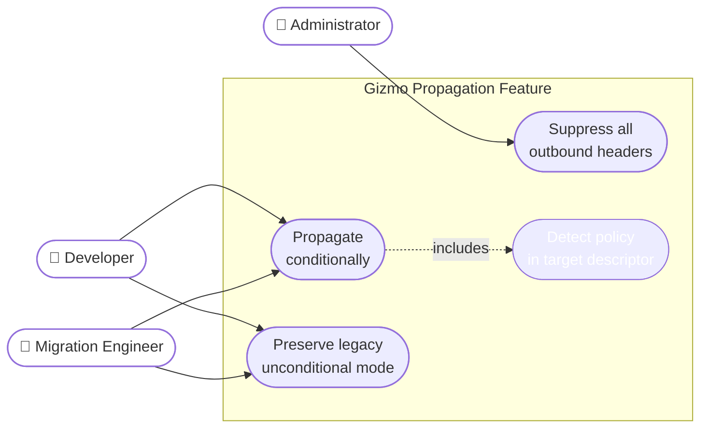
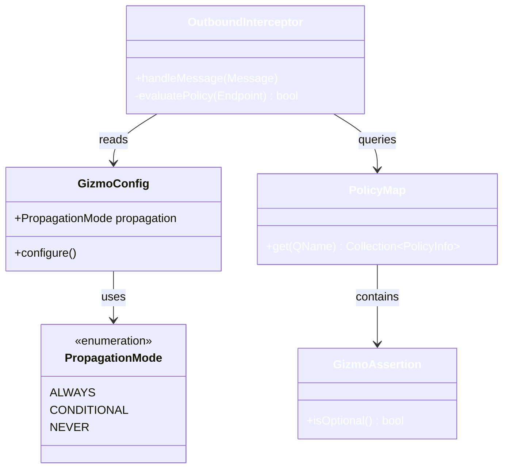
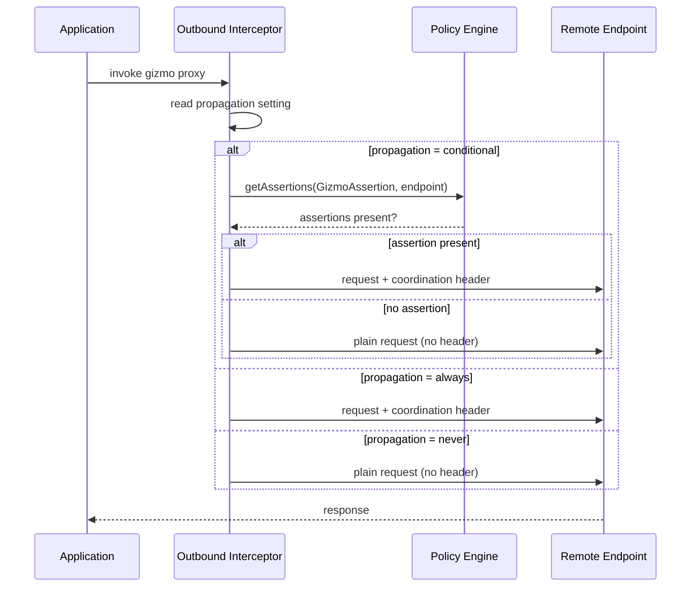
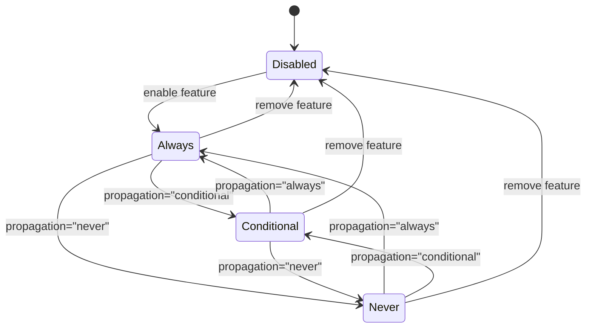
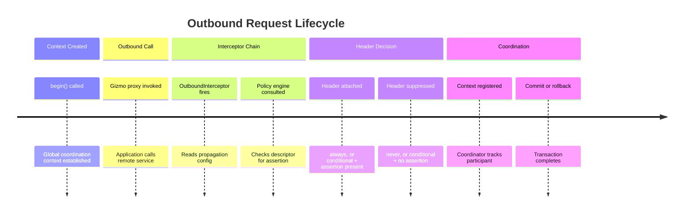
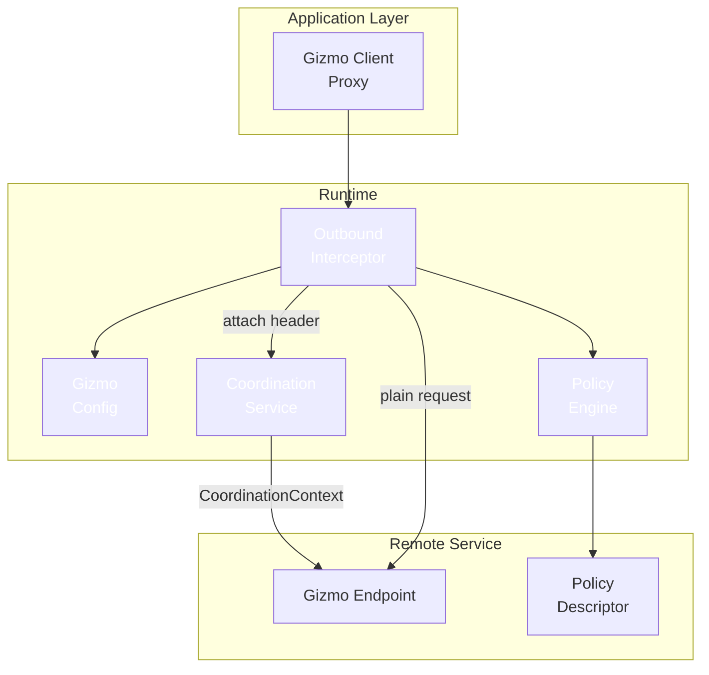
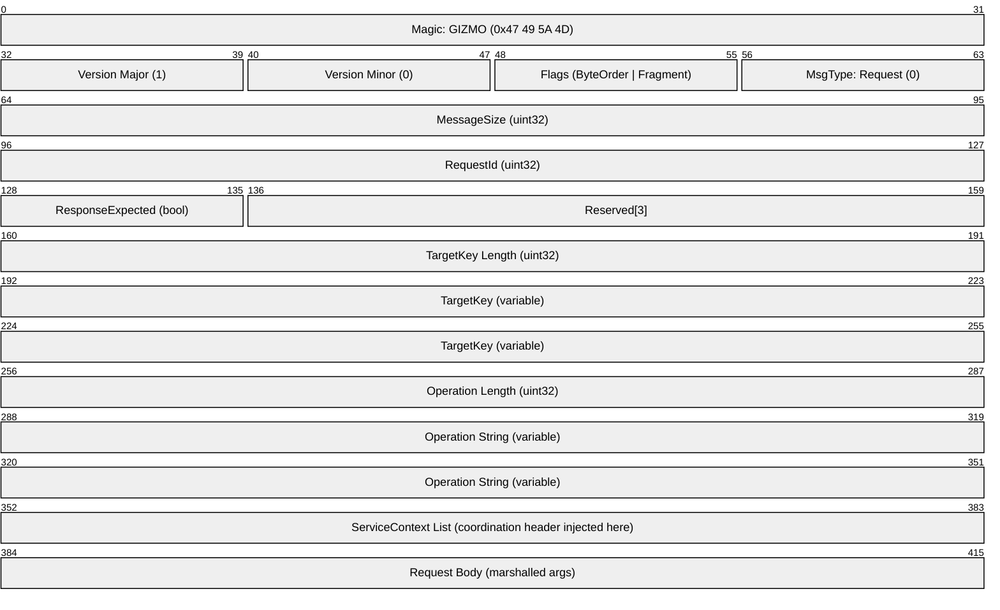

# Mermaid Diagram Types {.unnumbered}

```{=latex}
\sectionslide{Mermaid Diagram Types}
```

::: notes
All diagrams in this deck use colours exclusively from the UFO theme palette
(ufonavydark, ufoteal, cvdblue, cvdviolet, cvdgold, cvdorange, cvdmagenta).
Colour variables are resolved by the Lua filter before the diagram is sent to
mmdc — authors write \$cvdblue rather than \#648fff.
:::

# Flowchart

```mermaid
%%{init: {"theme": "base", "themeVariables": {
  "primaryColor": "$cvdblue",
  "primaryBorderColor": "$ufoteal",
  "primaryTextColor": "$ufonavydark",
  "lineColor": "$ufonavydark",
  "clusterBkg": "#f0f0ff",
  "clusterBorder": "$ufoteal"
}, "flowchart": {"curve": "stepBefore"}} }%%
flowchart LR
  A([Outbound Request]) --> B{Global context\nactive?}
  B -->|yes| C{Feature\nenabled?}
  B -->|no| F([Send plain request])
  C -->|no| F
  C -->|yes| D{propagation?}
  D -->|always| E[Attach header]
  D -->|never| F
  D -->|conditional| G{Policy\nasserted?}
  G -->|yes| E
  G -->|no| F
  E --> F
  classDef decision fill:$cvdblue,stroke:$ufoteal,color:$ufonavydark
  classDef terminal fill:$cvdviolet,stroke:$ufoteal,color:#ffffff
  class B,C,D,G decision
  class A,F terminal
```

::: notes
Flowchart with stepBefore routing. Decision nodes use \$cvdblue fill; terminal
nodes use \$cvdviolet. \$name variables are substituted by the Lua filter before
the diagram is passed to mmdc — no raw hex values appear in the source.
:::

# Swimlane Diagram

```mermaid
swimlane-beta LR
  subgraph Application
    Invoke[Invoke gizmo proxy]
    Receive[Receive response]
  end
  subgraph Runtime
    Check[Check global context]
    Decide[Evaluate propagation]
    Attach[Attach header]
    Plain[Send plain request]
  end
  subgraph RemoteEndpoint
    Process[Process request]
    Respond[Send response]
  end
  Invoke --> Check
  Check --> Decide
  Decide --> Attach
  Decide --> Plain
  Attach --> Process
  Plain --> Process
  Process --> Respond
  Respond --> Receive
```

::: notes
Native swimlane diagram using the \texttt{swimlane-beta} diagram type
(Mermaid \(\geq\)11). Each subgraph becomes a distinct horizontal lane — the
lane boundaries show which actor owns each activity. Cross-lane arrows show
handoffs between actors. This is a fundamentally different concept from a
flowchart: ownership of activities is the primary information, not decision
logic.
:::

# Subgraph Layout (per-lane CSS)

```mermaid
%%{init: {"theme": "base", "themeVariables": {
  "primaryColor": "$cvdblue",
  "primaryBorderColor": "$ufoteal",
  "primaryTextColor": "$ufonavydark",
  "lineColor": "$ufonavydark",
  "clusterBkg": "transparent",
  "clusterBorder": "$ufoteal"
}} }%%
%% @css #my-svg-app > rect     { fill: #e8f4ff !important; stroke: $cvdblue   !important; stroke-width:2px !important; }
%% @css #my-svg-runtime > rect { fill: #f0edff !important; stroke: $cvdviolet !important; stroke-width:2px !important; }
%% @css #my-svg-remote > rect  { fill: #fff8e8 !important; stroke: $cvdgold   !important; stroke-width:2px !important; }
flowchart LR
  subgraph app ["Application"]
    A([Call gizmo\nproxy])
  end
  subgraph runtime ["Runtime: Interceptor Chain"]
    B{Global context\nactive?}
    C{propagation\nsetting?}
    D{Policy\nasserted?}
    E[Attach header]
    F[Send plain\nrequest]
    E ~~~ F
  end
  subgraph remote ["Remote Endpoint"]
    H([Process\nrequest])
  end
  A --> B
  B -->|no| F
  B -->|yes| C
  C -->|always| E
  C -->|never| F
  C -->|conditional| D
  D -->|yes| E
  D -->|no| F
  E --> H
  F --> H
  classDef dec fill:$cvdblue,stroke:$ufoteal,color:$ufonavydark
  class B,C,D dec
```

::: notes
Flowchart with subgraphs used as visual grouping zones — a common pattern
for showing which system owns which nodes. Per-lane background colours and
borders are applied via \%\% \@css annotations: the Lua filter writes them
to a temp CSS file and passes \texttt{-C cssfile} to mmdc. SVG subgraph
element IDs follow the pattern \texttt{\#my-svg-\{subgraph-id\} > rect}.
Note: this is not a true swimlane — it is a flowchart with grouped regions.
:::

# Use Case Diagram



::: notes
Use case diagram using Mermaid flowchart LR. Actors are plain white rounded
rectangles outside the system boundary subgraph. Primary use cases are
\$cvdblue; supporting use cases (included) are \$cvdviolet. The dashed include
relationship uses Mermaid's native dotted arrow syntax.
:::

# Class Diagram



::: notes
Class diagram showing the five key classes involved in conditional gizmo
propagation. Each class uses a distinct CVD-safe palette colour — all five
categorical slots are used here to demonstrate the full palette.
:::

# Sequence Diagram



::: notes
Sequence diagram showing the interceptor chain decision for the three
propagation modes. The default themeVariables init block applies \$cvdblue
actor backgrounds and \$ufoteal borders automatically — no explicit classDef
needed in sequence diagrams.
:::

# State Diagram



::: notes
State diagram showing the propagation mode state machine. The three active
states (Always, Conditional, Never) each represent a distinct outbound
behaviour. Default themeVariables supply the palette colours.
:::

# Timeline Diagram



::: notes
Timeline event modelling diagram showing the lifecycle of an outbound
request from context creation through coordination completion. The timeline
type uses cScale0-4 for section colours — these are set to the CVD palette
by the default themeVariables init block.
:::

# Architecture Diagram



::: notes
C4-style component architecture diagram using graph TB with subgraphs as
layers. Application, runtime, and remote service layers use three distinct
CVD palette colours (\$cvdblue, \$cvdviolet, \$cvdgold) so they are
distinguishable in greyscale and under all common CVD types.
:::

# Packet Diagram



::: notes
Packet diagram showing a fictional GIZMO 1.0 request message format. The
coordination header is injected into the ServiceContext list (bytes 352-383)
by the OutboundInterceptor when propagation conditions are met.
The packet-beta diagram type requires Mermaid \geq 11.0 (mmdc \geq 12.0).
:::
